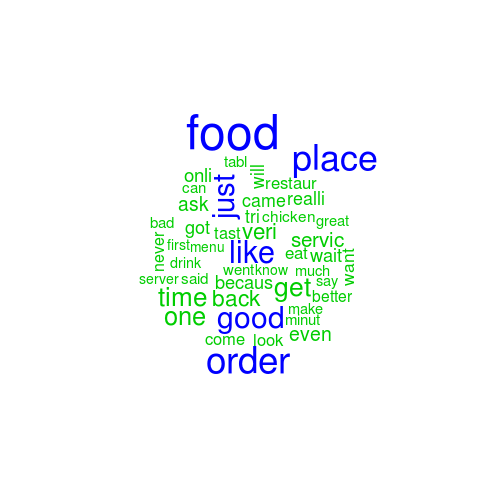
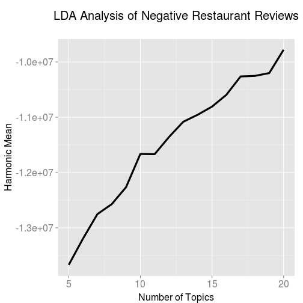

## Introduction

_“The most important thing in communication is hearing what isn't being said. 
The art of reading between the lines is a life long quest of the wise.”_  
― Shannon L. Alder

The following report seeks to assist restaurant businesses to answer the 
question on the Top 10 related topics that reviewers have to say when giving 
restaurants negative reviews. 

Topics generated from `Latent Dirichlet Allocation`, a Topic Modelling 
algorithm, show that customers generally give 1-2 stars review if they:
1. Went to the restaurant at night
2. Long waiting time
3. Accompanied by friends
4. Had orders taken back to the kitchen
5. Ate at the restaurant
6. Had interactions with the service staff
7. Enjoyed great service and food (probably hard to please)
8. Tend to have fried chicken
9. Pricing of the restaurant menu
10. Not a returning customer

## What is Topic Model and Latent Dirichlet Allocation?
Topic Models is a research field in Natural Language Processing and Machine 
Learning. The models which are built on a collection of documents, are 
probabilistic in nature and seeks to discover abstract "topics" in the 
collection of documents. In short, attempts to cluster words into bags of 
"topics".

The topic modelling algorithm used in the report is Latent Dirichlet Allocation
(LDA) which is a Bayesian Network and a probabilistic model.

The algorithm performs topic discovery with the following steps:
1. Pre-defining the number of topics or find the LDA model with the highest 
statistical certainty (logisitic likelihood).
2. Assign every word to a temporary topic in a semi-random manner 
(using Dirichlet distribution).
3. Update the topic assignments based on prevalence of the particular word 
across topics and prevalence of topics in the particular document

## Data Preprocessing Methods

### Obtaining the data

The zip file containing the dataset was downloaded from this [link](https://d396qusza40orc.cloudfront.net/dsscapstone/dataset/yelp_dataset_challenge_academic_dataset.zip) on the Coursera Course mainpage. This was then extracted into _"raw_data"_ directory.

### Importing the data

The relevant data, namely business and reviews, were imported and saved in _"imported_data"_ using `jsonlite` package.


```r
library(jsonlite)

# Setting variables for individual JSON files
json_business <- "raw_data//yelp_academic_dataset_business.json"
json_review <- "raw_data//yelp_academic_dataset_review.json"

# Reading in each json file and store as RData object for ease of loading
business <- stream_in(file(json_business))
save(business, file="imported_data//business.RData")

review <- stream_in(file(json_review))
save(review, file="imported_data//review.RData")
```

### Extracting the relevant data

Following this, the data from restaurant business category was extracted from 
the business dataset and joined with review dataset using the column
`business_id`. After the join, restaurant related reviews of 1-2 stars were
extracted for preprocessing in the next step.


```r
# load data
load("imported_data//business.RData")
load("imported_data//review.RData")

#Filter businesses to target only Restaurants
restaurants<-business[grep("Restaurants",business$categories),]

#Filter reviews for restaurants
restaurantreview <- review[review$business_id %in% restaurants$business_id,]

#Obtain low star reviews
lowstarreview<-restaurantreview[restaurantreview$stars < 3, ]

#Number of reviews to perform text mining on
length(lowstarreview$stars)
```

### Preprocessing and Cleaning of the Corpus

The text from low starred restaurant reviews were put into a Corpus which then
undergo the following data cleaning steps:
1. Removal of non-ASCII characters
2. Setting all characters to lower case
3. Removal of stop words (words like _the, is, at, which_ etc)
4. Removal of numbers
5. Removal of puncuations 
6. Stemming to obtain the English root word
7. Filtering of words below 3 characters
8. Filtering of words that are rarely found across all reviews

Lastly, irrelevant reviews with words that were filtered by the previous steps
were also removed from the Corpus.


```r
library(tm)
library(SnowballC)
library(stringi)
library(slam)

#Function for removing non ascii characters
removeNonASCII <- function(x) 
{
    iconv(x, "latin1", "ASCII", sub="")
} 

#Create Corpus
reviewCorpus <- Corpus(VectorSource(lowstarreview$text))
save(reviewCorpus,file="work_data//originalCorpus.RData")
 

#Clean Corpus
reviewCorpus <- tm_map(reviewCorpus, content_transformer(removeNonASCII))
reviewCorpus <- tm_map(reviewCorpus, content_transformer(tolower))
#Create DTM
reviewDtm <- DocumentTermMatrix(reviewCorpus, control = list(stemming = TRUE, 
                                                             stopwords = TRUE,
                                                             removeNumbers = TRUE, 
                                                             removePunctuation = TRUE, 
                                                             minDocFreq=2, 
                                                             minWordLength=3))
save(reviewDtm,file="work_data//reviewDtm.RData")

#Remove Sparse Terms
reviewDtmCompact <- removeSparseTerms(reviewDtm, sparse=0.9)

#Find rows with empty documents
rowTotals <- apply(reviewDtmCompact , 1, sum)

#remove empty documents from the existing corpus and build a new one
reviewDtmCompact   <- reviewDtmCompact[rowTotals> 0, ]
save(reviewDtmCompact,file="work_data//reviewDtmCompact.RData")
```

## Preliminary Data Exploration

### Word Cloud and Exploring the feasibility of the Question


```r
reviewDtmCompact$nrow
```

```
## [1] 183176
```

```r
reviewDtmCompact$ncol
```

```
## [1] 90
```

After the data preprocessing and removal of reviews that contains irrelevant 
terms, the number of reviews we are left with is `183176` and number of terms
is `90`.

Before diving deeper to perform the LDA modelling on the 1-2 star restaurant 
reviews, a wordcloud is used to determine whether there are distinct words with
high frequency in the 1-2 star restaurant review corpus to answer the question 
on the Top 10 related topics that reviewers have to say when giving 
restaurants negative reviews.


```r
library(wordcloud)
corpus.matrix <- as.matrix(reviewDtmCompact)
```

```
## Error: cannot allocate vector of size 125.8 Mb
```

```r
corpus.sorted <- sort(colSums(corpus.matrix), decreasing=TRUE)
terms <- names(corpus.sorted)
terms.df <- data.frame(word=terms, freq=corpus.sorted)
wordcloud(terms.df$word, colors=c(3,4), random.color=FALSE, terms.df$freq, min.freq=35000)
```

 

From the wordcloud, we could pick up terms like *order*,*place*,*food* that will
be relevant to answering our question. Also, terms like *like*,*just*,*good* may
not assist us much in determining the resulting topics. Despite the preliminary
word term exploration show that there may not be 10 distinct topics on 1-2 star 
restaurant reviews, we could still look at the resulting LDA model and find 
topics that will be relevant to the question.

## Topic Modelling and Results Discussion

### Searching for the Best Fit LDA Model

As we would not be able to identify the number of topics the review dataset 
would yield beforehand, LDA modelling was performed for 5-20 topics (due to 
computer limitations).


```r
library(tm)
library(SnowballC)
library(topicmodels)

# Due to the vast amount of reviews, I will only run this for 100 iterations
topicNum <- seq(5, 20, 1)
burnin <- 100
iter <- 100
keep <- 50
fitted_many <- lapply(topicNum, function(k) LDA(reviewDtmCompact, 
                                                k = k,
                                                method = "Gibbs",
                                                control = list(burnin = burnin,
                                                               iter = iter, 
                                                               keep = keep)))
```

After running LDA models on 5-20 topics, each model would yield a logistic 
likelihood, which is the statistical significance of the model. Using this, we 
could derive the harmonic mean of each LDA model and determine the likelihood of
the review dataset given the number topics. In other words, the higher the
harmonic mean, the higher the likelihood of the dataset would yield the
number of topics.


```r
library(Rmpfr)
#Function to calculate harmonic mean
harmonicMean <- function(logLikelihoods, precision = 2000L) {
    llMed <- median(logLikelihoods)
    as.double(llMed - log(mean(exp(-mpfr(logLikelihoods,
                                         prec = precision) + llMed))))
}

#Extract logliks from each topic
logLiks_many <- lapply(fitted_many, function(L)  L@logLiks[-c(1:(burnin/keep))])

#Compute harmonic means
hm_many <- sapply(logLiks_many, function(h) harmonicMean(h))
```

With the harmonic mean from each of the LDA model of 5-20 topics, the topic 
number is plotted against harmonic mean to choose the best fit model.


```r
ldaplot <- ggplot(data.frame(topicNum, hm_many), aes(x=topicNum, y=hm_many)) + geom_path(lwd=1.5) +
    theme(text = element_text(family= NULL),
          axis.title.y=element_text(vjust=1, size=16),
          axis.title.x=element_text(vjust=-.5, size=16),
          axis.text=element_text(size=16),
          plot.title=element_text(size=20)) +
    xlab('Number of Topics') +
    ylab('Harmonic Mean') +
    ggtitle(expression(atop("LDA Analysis of Negative Restaurant Reviews")))
ldaplot
```

 

From the results of the plot, the LDA model with 20 topics was chosen to derive
the top 10 topics on 1-2 star reviews for restaurants.


```r
# Obtain the 20 topic LDA model for further analysis
model<-fitted_many[[16]]
```

## Results of the LDA

With the 20 topic LDA model, the top 5 terms related to the 20 topics were 
extract and put into `topicLabel` and take a look at the resultant topics.


```r
review.terms <- as.data.frame(terms(model, 30), stringsAsFactors = FALSE)
topicTerms <- gather(review.terms, ReviewTopic)
# Rank the topics
topicTerms <- cbind(topicTerms, Rank = rep(1:30))
# Filter the top 5 terms for each topic
topTerms <- filter(topicTerms, Rank < 6)
topTerms <- mutate(topTerms, ReviewTopic = word(ReviewTopic, 2))
topTerms$ReviewTopic <- as.numeric(topTerms$ReviewTopic)
topicLabel <- data.frame()
# Combine the top 5 terms in each topic as label
for (i in 1:20){
    term <- filter(topTerms, ReviewTopic == i)
    combined.frame <- as.data.frame(paste(term[1,2], term[2,2], 
                                          term[3,2], term[4,2],
                                          term[5,2], sep = " " ), 
                                    stringsAsFactors = FALSE)
    topicLabel <- rbind(topicLabel, combined.frame)
}
colnames(topicLabel) <- c("Label")
```

We could group reviewers giving restaurant 1-2 star reviews based on the top 5 
terms from the top 10 topics in the LDA model.


```r
topicLabel[1:10,]
```

```
##  [1] "night use went back still"      "wait minut waitress tabl anoth"
##  [3] "got friend one went even"       "order came take took back"     
##  [5] "eat can here peopl make"        "ask said server told came"     
##  [7] "food servic service great good" "tast chicken like fri good"    
##  [9] "better price much way noth"     "never will back again ever"
```

## Discussion on the Topics from LDA model

### Inference of Topics based on terms
Based on the top 10 topics of 1-2 star reviews tend to be given restaurants, we 
could infer the following customer behaviour that results in low star reviews:

1. Went to the restaurant at night
2. Long waiting time
3. Accompanied by friends
4. Had orders taken back to the kitchen
5. Ate at the restaurant
6. Had interactions with the service staff
7. Enjoyed great service and food (probably hard to please)
8. Tend to have fried chicken
9. Pricing of the restaurant menu
10. Not a returning customer

### Further Topic model exploration through visualization with LDAvis

The top 10 topics inferred using the top 5 probability of terms appearing in
a topic may not represent the topic correctly, hence, the R `LDAvis` package
is used to generate an interactive visualization to explore topics related to 
1-2 star restaurant reviews.

Firstly, the corpus is transformed into a JSON file to be read into the 
visualization.


```r
#Function to transform LDA model into JSON for display
topicmodels_json_ldavis <- function(fitted, corpus, doc_term){
    # Required packages
    library(topicmodels)
    library(dplyr)
    library(stringi)
    library(tm)
    library(LDAvis)
    
    # Find required quantities
    phi <- posterior(fitted)$terms %>% as.matrix
    theta <- posterior(fitted)$topics %>% as.matrix
    vocab <- colnames(phi)
    doc_length <- vector()
    for (i in 1:length(corpus)) {
        temp <- paste(corpus[[i]]$content, collapse = ' ')
        doc_length <- c(doc_length, stri_count(temp, regex = '\\S+'))
    }
    temp_frequency <- inspect(doc_term)
    freq_matrix <- data.frame(ST = colnames(temp_frequency),
                              Freq = colSums(temp_frequency))
    rm(temp_frequency)
    
    # Convert to json
    json_lda <- LDAvis::createJSON(phi = phi, theta = theta,
                                   vocab = vocab,
                                   doc.length = doc_length,
                                   term.frequency = freq_matrix$Freq)
    
    return(json_lda)
}

# Convert reviewDtmCompact back to corpus for LDAvis json creation
dtm2list <- apply(reviewDtmCompact, 1, function(x) {
    paste(rep(names(x), x), collapse=" ")
})
reviewCorpus <- VCorpus(VectorSource(dtm2list))

# Generate JSON to be passed into serVis to display the LDA visualization
ldavis_json<-topicmodels_json_ldavis(model,reviewCorpus,reviewDtmCompact)

# To upload the visualization to github for sharing
serVis(ldavis_json, as.gist=TRUE)
```

The link of the uploaded visualization of the 20-topic LDA model can be accessed
from [link](http://bl.ocks.org/crusainte/raw/8c348220ad876284d667/#topic=0&lambda=1&term=).
